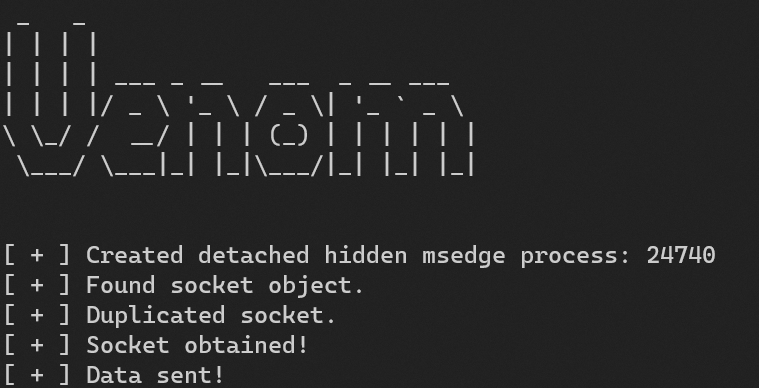

# Venom

 

Venom is a C++ library that is meant to give an alternative way to communicate, instead of creating a socket that could be traced back to the process, it creates a new "hidden" (there is no window shown) detached edge process (edge was chosen because it is a browser that is installed on every Windows 10+ and won't raise suspicious) and stealing one of its sockets to perform the network operations.

The benefit of creating a detached browser process is that there is no danger that it will be closed accidentally by the user and the sockets exist but not communicating with any site, therefore avoiding possible collisions.

## Usage



Venom is a single C++ header file so you can just include it in your project and use it as follows:

```cpp
Venom venom = Venom(L"127.0.0.1", 3110);

if (!venom.VenomObtainSocket()) {
    std::cerr << "[ - ] Failed to get socket." << std::endl;
    venom.~Venom();
    return -1;
}

// Do your stuff here.
...

venom.~Venom();
```

You can see the [example](https://github.com/idov31/Venom/blob/master/Venom/VenomExample.cpp) that shows how to use the socket for sending or receiving data.

## Technical Explanation

The core reason why it works, or to be exact, why the sending and receiving with a socket (possibly connected) without any problem is in the functions documentation.

Before I'll explain more about that, I chose to create a new edge process over using an already opened one for 2 main reasons:

- You can't know if the browser socket is already in use and it might cause a collision if you are trying to receive data.

- A process that you created can be closed by mistake at any time by the user, meaning cutting your communication.

Now that you understood the reasons behind creating a new process, I can explain why I can use an already existing socket (which might be connected) to communicate with a target (without connecting it to it).

- Sending: To send, you can use [sendto](https://learn.microsoft.com/en-us/windows/win32/api/winsock/nf-winsock-sendto) function and in the documentation, you can read that Microsoft wrote: *"A descriptor identifying a **(possibly connected)** socket."*. 

Moreover, you can read that they also wrote *"... Even if the connectionless socket has been previously connected to a specific address, the **to parameter overrides the destination address** ..."* meaning, we can override the target with sendto.

- Receiving: To receive data, you can use [recv](https://learn.microsoft.com/en-us/windows/win32/api/winsock/nf-winsock-recv) function and because no user using this browser process, it reduces greatly the chances of collision.

## Contributors

- [Florian Roth](https://github.com/Neo23x0)

## Resources

- [ShadowMove](https://github.com/0xcpu/winsmsd)
